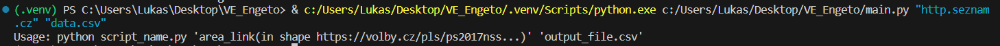
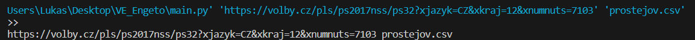
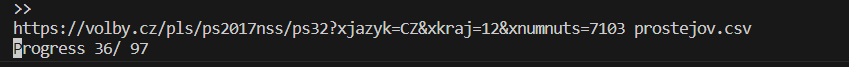
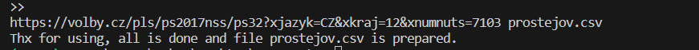
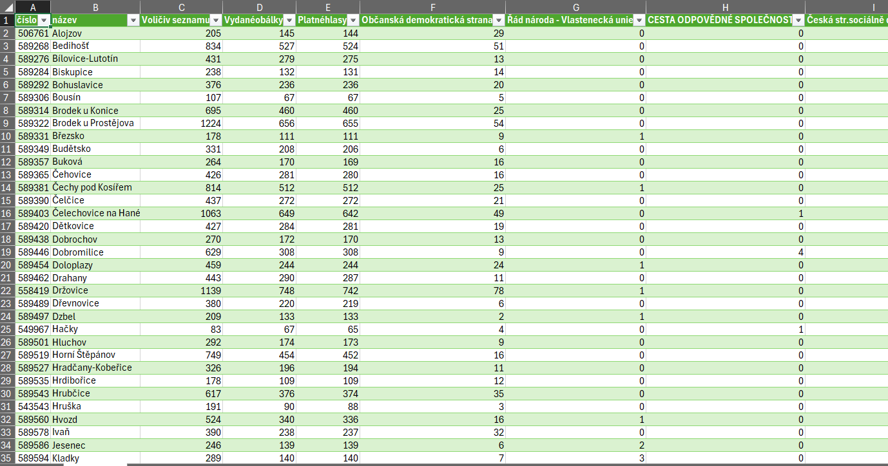

# Engeto---third-project
Election Data Scraper

* main.py: třetí projekt do Engeto Online Python Akademie
* author: Lukas Zeizinger
* email: zeizingerlukas@gmail.com
* discord: Lukáš Zeizinger _nantuko


<!-- TABLE OF CONTENTS -->
## Table of Contents

- [Engeto---third-project](#engeto---third-project)
  - [Table of Contents](#table-of-contents)
  - [About The Project](#about-the-project)
- [Election Data Scraper](#election-data-scraper)
  - [Getting Started](#getting-started)
    - [Prerequisites](#prerequisites)
    - [Installation](#installation)
  - [Usage](#usage)
  - [Functionality](#functionality)
    - [1. Argument Validation:](#1-argument-validation)
    - [2. Web Scraping:](#2-web-scraping)
    - [3. Data Processing:](#3-data-processing)
    - [4. Data Frame Creation:](#4-data-frame-creation)
    - [5. Output File Handling:](#5-output-file-handling)
  - [Example](#example)
  - [License](#license)
  - [Contact](#contact)


<!-- ABOUT THE PROJECT -->
## About The Project

# Election Data Scraper

This Python script is designed to scrape election data from the Czech Statistical Office (https://volby.cz/). It extracts information about registered votes and voting tables for a specified area and generates a CSV file with the collected data.

<!-- GETTING STARTED -->
## Getting Started
* Download the extension and use for it requirements.txt

### Prerequisites

* [VS Code](https://code.visualstudio.com)
* Make sure you have Python installed on your system. Additionally, install the required Python modules using:

```bash
pip install requests

pip install bs4

pip install pandas

pip install numpy
```


### Installation

Download this program directly from github [Engeto---third-project](https://github.com/LukasZeizinger/Engeto---third-project)


<!-- USAGE EXAMPLES -->
## Usage

Run the script using the following command:

```bash
python script_name.py 'area_link' 'output_file.csv'
```

* "area_link": The URL of the area from which you want to scrape election data. It should be in the format: https://volby.cz/pls/ps2017nss/...

* "output_file.csv": The name of the CSV file where the scraped data will be saved.

```bash
python main.py 'https://volby.cz/pls/ps2017nss/ps32?xjazyk=CZ&xkraj=12&xnumnuts=7103' 'prostejov.csv'
```


<!-- Functionality -->
## Functionality
The script performs the following tasks:

Checks if the correct number of arguments is provided.
Verifies if the provided 'area_link' conforms to the expected format.
Scrapes and processes information about registered votes and voting tables from the specified area.
Transposes the obtained data and merges it into a comprehensive DataFrame.
Creates a directory for the output file if it doesn't exist.
Saves the collected data as a CSV file in the specified output directory.

### 1. Argument Validation:

The script begins by checking whether the correct number of arguments is provided during execution. If the required arguments are not provided, the script displays usage instructions and exits.

```bash
def concat(s1, s2):
    if len(sys.argv) != 3:
        print("Usage: python script_name.py 'area_link' 'output_file.csv'")
        sys.exit(1)
    elif "https://volby.cz/pls/ps2017nss/" not in s1:
        print("Usage: python script_name.py 'area_link(in shape https://volby.cz/pls/ps2017nss...)' 'output_file.csv'")
        sys.exit(1)
```

### 2. Web Scraping:

The script utilizes the requests library to download the HTML content of the specified 'area_link.' It then employs the BeautifulSoup library to parse the HTML and extract relevant information.

```bash
def download_data(webpage):
    d_local_data = []
    d_local_data.clear()
    claim = requests.get(webpage)
    claim.raise_for_status()
    d_local_data.append(_find_topic_data(claim.text))
    d_local_data.append(_find_table_data(claim.text))
    return flatten_extend(d_local_data)
```
### 3. Data Processing:

The script defines functions like _find_topic_data and _find_table_data to process the HTML content and extract specific data related to registered votes and voting tables.
```bash
def _find_topic_data(html):
    soup = BeautifulSoup(html, features="html.parser")
    header_classes = ["sa2", "sa3", "sa6"]
    ingredience_data = []

    for header_class in header_classes:
        ingredience = soup.find_all(class_="cislo", headers=header_class)
        ingredience_data.extend([data.text.strip() for data in ingredience])

    return ingredience_data

def _find_table_data(html):
    soup = BeautifulSoup(html, features="html.parser")
    header_classes = ["t1sb3", "t2sb3"]
    ingre_table_data = []

    for header_class in header_classes:
        ingredience = soup.find_all(class_="cislo", headers=header_class)
        ingre_table_data.extend([data.text.strip() for data in ingredience])

    return ingre_table_data
```
### 4. Data Frame Creation:

The script creates a Pandas DataFrame by transposing and merging the obtained data. It also concatenates additional data from subsequent URLs to create a comprehensive dataset.
```bash
def _dframe(main_data, column2, column1):
    df = main_data
    tt = df.transpose()
    df1 = pd.DataFrame(np.array(tt), columns=column1[0])

    df2 = _url_creator(d_loc_data, column2)

    result_frame = pd.concat([df1, df2], axis=1)

    return result_frame
```
### 5. Output File Handling:

The script ensures that the output directory exists and saves the collected data as a CSV file in the specified location.
```bash
def dwn_main_webpage(www, output_file):
    # ... (code for obtaining data)
    d_f = _dframe(pd.DataFrame(np.array(d_loc_data)), _title_url(d_loc_data[0][0]), title_data)

    script_directory = os.path.dirname(os.path.abspath(__file__))
    output_directory = os.path.join(script_directory, "Python-output")
    os.makedirs(output_directory, exist_ok=True)

    output_path = os.path.join(script_directory, str(output_file))
    d_f.to_csv(output_path, index=False)

```
<!-- EXAMPLE-->
## Example
Argument Validation:

The script begins by checking whether the correct number of arguments is provided during execution. If the required arguments are not provided, the script displays usage instructions and exits:



If arguments are correct:



Then script run...


And exiting message...



Output data



<!-- LICENSE -->
## License

This is a school example, it should be here anyway:

"Distributed under the MIT License. See license [MIT](https://choosealicense.com/licenses/mit/) for more information."


<!-- CONTACT -->
## Contact

Lukáš Zeizinger - zeizingerlukas@gmail.com

Project Link: [https://github.com/LukasZeizinger/Engeto---third-project](https://github.com/LukasZeizinger/Engeto---third-project)

